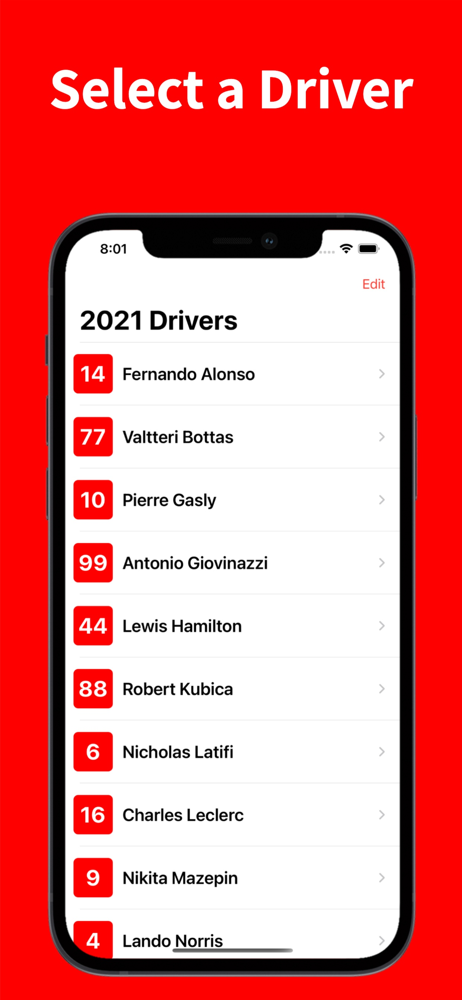
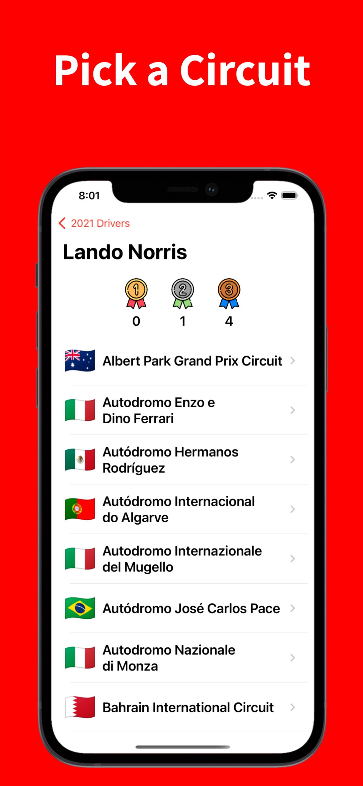
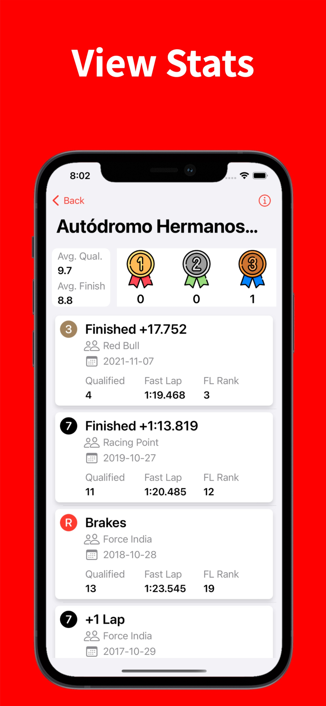

# Formula Driver Stats

**Features:**

- Check out historical driver statistics from Formula 1. 
- Select a driver, then circuit, and see how they have performed historically.

**App Screenshots**

  

**Key Code Implementations:**
- Call to server for a variety of data utilizing networking concepts
- Custom table view cells
- Programmatic UI
- Formats data in a logical fashion for user consumption

**Links:**

Formula Driver Stats in the App Store: (coming soon)

Icons made by freepik, and Pixel perfect from www.flaticon.com. Ergast API is utilized for data.

